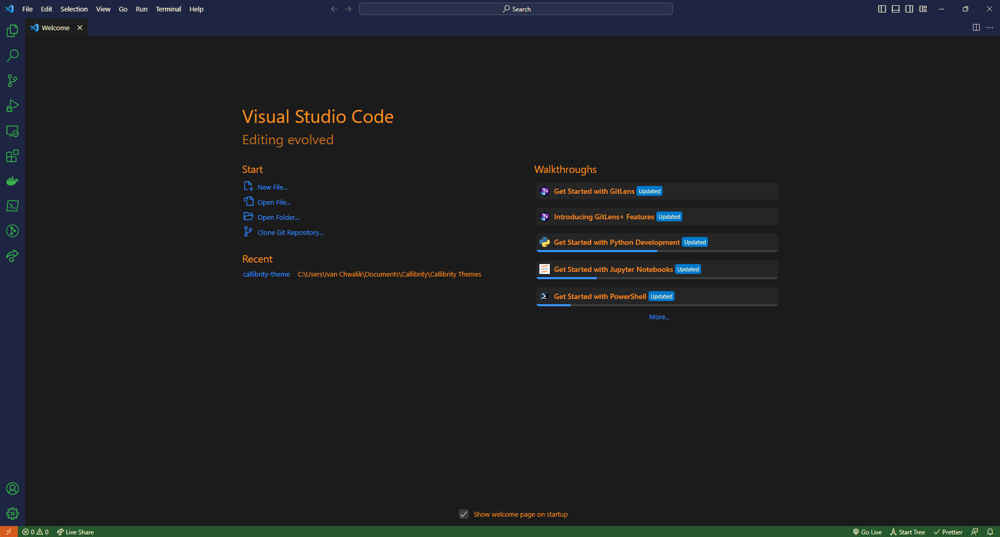

# Callibrity's Developer Theme

Oh? You're a developer huh?

So, you must like coding, right?

Well why don't you check out a company that's
_for developers,_
_by developers!_

We do all kinds of things like:

- bring you to the cloud
- automate your workflow by helping you build out your CI/CD
- revamp your legacy solution with modern tools
- and so much more!

Check out Callibrity at <https://www.callibrity.com/>

## Color me surprised (°.°)

Active, Open Solution

No Solution

## Myself

Hey! Thanks for checking out this theme!
I'm a software developer here at Callibrity and just loved the company colors so much that I thought I'd integrate it into my solution. 😎

Out of one rabbit hole and into the next.
Love,

\- [Ivan](https://github.com/ivan-the-terrible) _the not so terrible_ ❤️

## Installation

To install manually instead of the Store: go to Releases, find the VSIX file and download that.\
Use `code --install-extension .\callibrity-theme-0.0.1.vsix` to install it within VSCode.\
Then, with VSCode open, you can do any of the following:

- go to the extension and click "Set Color Theme"
- use the CTRL + K, CTRL + T shortcut to select the "Callibrity" theme from the list
- use the Command Palette (CTRL + SHIFT + P) to search for Themes and select the "Callibrity" theme from the list

## <u>Developer Notes</u>

To create this, I needed to follow [this guide](https://code.visualstudio.com/api/extension-guides/color-theme#create-a-new-color-theme).

Essentially you need these two tools:

`npm i -g yo generator-code` to create the project\
`npm i -g @vscode/vsce` to build the VSIX file

Once you've made changes, you'll need to `vsce package` to build the VSIX file.\
Use `code --install-extension .\callibrity-theme-0.0.1.vsix` to install it within VSCode.

To use this within Visual Studio, see the following video from Microsoft: <https://www.youtube.com/watch?v=2Gwqr5uuBt4>

Yes, those are their instructions.\
There is an open source tool they're pointing you to use to basically side load the theme. Ridiculous.

Basically, you'll want to clone this repo and follow the instructions: <https://github.com/microsoft/theme-converter-for-vs>

It's literally formattting and color schemes. How could they have gotten this so badly wrong :eye-roll:

## **Enjoy!**
